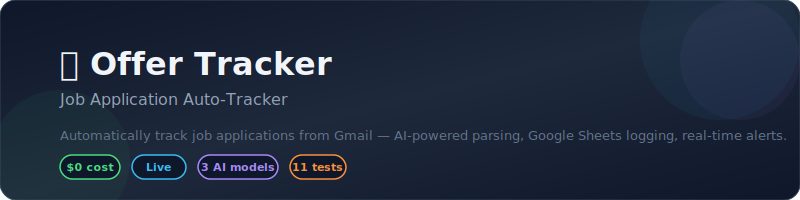
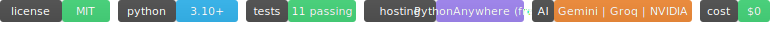
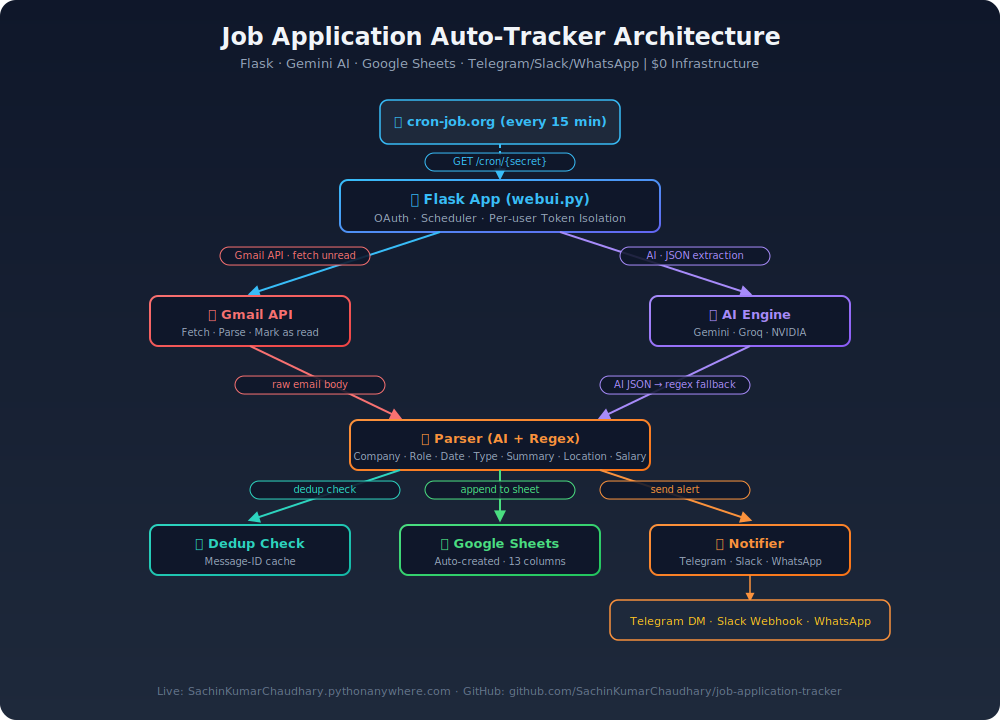
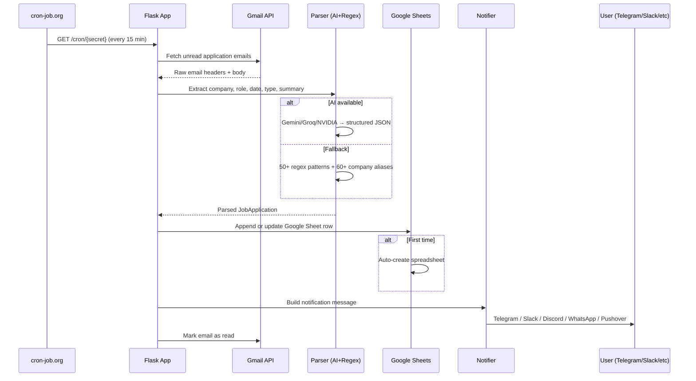
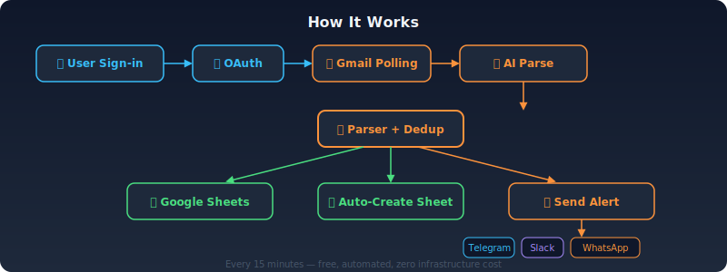

<p align="center">
  
</p>

<p align="center">
  
</p>

<p align="center">
  👉 <strong><a href="https://SachinKumarChaudhary.pythonanywhere.com/">Live Demo</a></strong>  ·  📖 <a href="PROJECT_REFERENCE.md">Technical Reference</a>  ·  📓 <a href="CASE_STUDY.md">Case Study</a>
</p>

<br>

## Architecture

<p align="center">
  
</p>

### Data Flow



<br>

## How It Works

<p align="center">
  
</p>

1. **User signs in** with Google → OAuth grants Gmail + Sheets scope
2. **User chooses notification** — Telegram, Slack, Discord, WhatsApp, or Pushover
3. **User sends a test email** to themselves with an application subject
4. **Scheduler polls Gmail** every 15 min — matches application/offer subjects
5. **Parser extracts** company, role, date, type, location, salary, next step:
   - AI path: Gemini/Groq/NVIDIA returns structured JSON
   - Regex path: 50+ company patterns, 15+ role patterns, 8-stage keyword classifier, 60+ company aliases
6. **Logs to Google Sheets** — auto-created spreadsheet with 13 columns, in-place updates when status progresses
7. **Sends notification** — Telegram DM / Slack / Discord / WhatsApp / Pushover
8. **Marks as read** — email removed from UNREAD to avoid re-processing

<br>

## Features

<div align="center">

| Feature | Detail |
|:---|---:|
| **Multi-user Gmail OAuth** | Each user connects personal Gmail, tokens isolated via base64 encoding |
| **AI Email Parsing** | Gemini (free), Groq, or NVIDIA extracts structured data from application emails |
| **Regex Fallback** | 50+ company patterns, 15+ role patterns, 60+ company aliases, 8-stage email classifier |
| **Google Sheets Logging** | Auto-creates spreadsheet per user with 13 typed columns + in-place status updates |
| **8-Stage Pipeline** | received → assessment → phone_screen → interview → tech_interview → offer (or rejection) |
| **Multi-channel Alerts** | Telegram DM, Slack webhook, Discord webhook, WhatsApp (CallMeBot/Cloud/Twilio), Pushover |
| **24/7 Automation** | cron-job.org pings every 15 min — polls all users in one request |
| **XLSX Export** | One-click download with styled headers, alternating rows, frozen panes |
| **Sheet Formatting** | Dark navy headers, alternating banding, auto-resize columns, frozen header row |
| **Two-Pass AI Filter** | Quick regex saves API credits by skipping non-job emails before AI call |
| **Email Normalization** | Gmail dots/case handled — same user recognized across devices |
| **11 Passing Tests** | Parser + model coverage |
| **$0 Budget** | PythonAnywhere free tier handles entire stack |

</div>

<br>

## Quickstart

```bash
git clone https://github.com/SachinKumarChaudhary/job-application-tracker
cd job-application-tracker
pip install -r requirements.txt
cp .env.example .env   # configure at least TELEGRAM_BOT_TOKEN
python webui.py        # runs at http://localhost:5000
```

### Required setup steps

1. **Create a Telegram bot** via [@BotFather](https://t.me/BotFather) — get `TELEGRAM_BOT_TOKEN`
2. **Set up Google Cloud OAuth** — enable Gmail API + Google Sheets API, download credentials
3. **(Optional) Add AI** — get a free API key from [makersuite.google.com](https://makersuite.google.com/) (Gemini), [Groq](https://console.groq.com), or [NVIDIA](https://build.nvidia.com/)
4. **Add cron-job.org** — create a free cron job hitting `https://your-app.pythonanywhere.com/cron/YOUR_SECRET` every 15 min

<br>

## Configuration

| Variable | Required | Description |
|:---|---:|:---|
| `TELEGRAM_BOT_TOKEN` | ✅ | Bot token from @BotFather |
| `TELEGRAM_BOT_USERNAME` | ✅ | Bot username (users DM this to connect) |
| `CRON_SECRET` | ✅ | Secret key in cron URL path |
| `GMAIL_QUERY` | ❌ | Gmail search query (default: application/offer subjects) |
| `AI_PROVIDER` | ❌ | `gemini`, `groq`, `nvidia`, or `none` (regex only) |
| `GEMINI_API_KEY` | ⚠️ | Required if `AI_PROVIDER=gemini` |
| `GROQ_API_KEY` | ⚠️ | Required if `AI_PROVIDER=groq` |
| `NVIDIA_API_KEY` | ⚠️ | Required if `AI_PROVIDER=nvidia` |
| `AI_MODEL` | ❌ | Model name (default: `gemini-2.0-flash`) |
| `POLL_INTERVAL_MINUTES` | ❌ | Poll interval (default: 15) |
| `PUSHOVER_TOKEN` | ❌ | Pushover app token for admin fallback |
| `PUSHOVER_USER` | ❌ | Pushover user key for admin fallback |
| `WHATSAPP_CLOUD_PHONE_NUMBER_ID` | ❌ | WhatsApp Cloud API phone number ID |
| `WHATSAPP_CLOUD_ACCESS_TOKEN` | ❌ | WhatsApp Cloud API access token |
| `TWILIO_ACCOUNT_SID` | ❌ | Twilio account SID for WhatsApp |
| `TWILIO_AUTH_TOKEN` | ❌ | Twilio auth token for WhatsApp |
| `LOG_LEVEL` | ❌ | `DEBUG`, `INFO`, `WARNING` (default: `INFO`) |

<br>

## Components

| Component | File | Lines | Role |
|:---|---:|:---:|:---|
| **Flask app** | `webui.py` | 910 | OAuth, routes, scheduler loop, per-user token isolation |
| **Poller** | `src/poller.py` | 85 | Gmail API fetch, header extraction, body parsing |
| **Parser** | `src/parser.py` | 283 | Company/role extraction, 8-stage classifier, 60+ aliases, AI integration |
| **AI layer** | `src/ai.py` | 134 | Gemini/Groq/NVIDIA API calls with JSON response parsing |
| **Models** | `src/models.py` | 88 | Pydantic `JobApplication` with 13-field sheet/alert formatting |
| **Notifier** | `src/notifier.py` | 185 | 7 channels: Telegram, Slack, Discord, WhatsApp (3x), Pushover |
| **Sheets** | `src/sheets_writer.py` | 47 | Google Sheets auto-create, append, dedup via Message-ID |
| **Dedup** | `src/duplicate_checker.py` | 27 | Message-ID cache to prevent duplicate processing |
| **Scheduler** | `src/scheduler.py` | 43 | CLI daemon (legacy — webui has its own scheduler) |
| **Web UI** | `templates/index.html` | 718 | Material Design 3 — dark/light, 4 tabs, responsive |
| **Dashboard** | `templates/_dashboard.html` | 326 | Dashboard partial — actions, stats, entries, per-channel alerts |

<br>

## Deployment

### PythonAnywhere (free)

```bash
# Upload code, set up virtual environment
mkvirtualenv offertracker --python=python3.10
pip install -r requirements.txt

# Configure WSGI to point to wsgi.py
# Set environment variables in PythonAnywhere dashboard → Web → Secrets
```

### cron-job.org (free 24/7)

Create a cron job hitting:
```
https://your-app.pythonanywhere.com/cron/YOUR_CRON_SECRET
```
Every 15 minutes → polls all connected users in one request.

<br>

## Testing

```bash
pytest -v

# Expected output:
# tests/test_models.py::test_job_application_defaults PASSED
# tests/test_models.py::test_job_application_from_email PASSED
# tests/test_models.py::test_job_application_to_sheet_row PASSED
# tests/test_parser.py::test_extract_company_regex PASSED  [8 more]
# ========== 11 passed in 0.15s ==========
```

<br>

## Roadmap

- [x] In-place sheet updates (company+role matching, priority-based status pipeline)
- [x] Two-pass AI pipeline (quick regex filter before NVIDIA call)
- [x] Company aliases (60+ ATS domain→canonical name mappings)
- [x] Full 8-stage status pipeline (received→assessment→phone→interview→tech→offer)
- [x] Discord notifications
- [x] WhatsApp Cloud API + Twilio WhatsApp
- [x] XLSX export
- [x] Sheet formatting (headers, banding, auto-resize, frozen rows)
- [x] Email normalization (Gmail dots/case)
- [x] Cache-Control fix (no OAuth callback caching)
- [ ] Dashboard charts — application trend, response rate, company breakdown
- [ ] Persistent state — move from in-memory dicts to SQLite
- [ ] Multi-language email parsing via AI

<br>

## Tech Stack

```
Language:     Python 3.10+
Framework:    Flask
AI:           Gemini / Groq / NVIDIA (via API)
Persistence:  Google Sheets (free database)
Auth:         Google OAuth 2.0
Notifications: Telegram Bot API · Slack Webhooks · Discord Webhooks · WhatsApp (CallMeBot/Cloud/Twilio) · Pushover
Automation:   cron-job.org (free, every 15 min)
Hosting:      PythonAnywhere free tier
Testing:      pytest (11 tests)
```

<br>

## License

MIT
