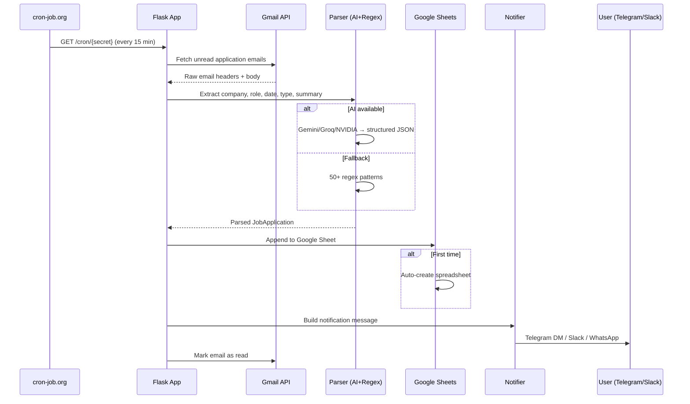

<p align="center">
  
  
  
  
  
  
  
</p>

<h1 align="center">📋 Offer Tracker — Job Application Auto-Tracker</h1>

<p align="center">
  <em>Automatically track job applications from Gmail — extracts company, role, and type via AI + regex, logs to Google Sheets, and sends real-time alerts to Telegram/Slack/WhatsApp. <strong>Zero infrastructure cost.</strong></em>
</p>

<p align="center">
  👉 <strong><a href="https://SachinKumarChaudhary.pythonanywhere.com/">Live Demo</a></strong>  ·  📖 <a href="PROJECT_REFERENCE.md">Technical Reference</a>  ·  📓 <a href="CASE_STUDY.md">Case Study</a>
</p>

<br>

## Architecture

<p align="center">
  
</p>

### Data Flow



<br>

## Features

<div align="center">

| 🚀 Feature | 💡 Detail |
|:---|---:|
| **Multi-user Gmail OAuth** | Each user connects personal Gmail, tokens isolated via base64 encoding |
| **AI Email Parsing** | Gemini (free), Groq, or NVIDIA extracts structured data from application emails |
| **Regex Fallback** | 50+ company patterns, 15+ role patterns, email type classifier |
| **Google Sheets Logging** | Auto-creates spreadsheet per user with 13 typed columns |
| **Multi-channel Alerts** | Telegram DM, Slack webhook, WhatsApp CallMeBot, Pushover |
| **24/7 Automation** | cron-job.org pings every 15 min — polls all users in one request |
| **Token-less Logout** | No login system — users just delete their bot DM or re-auth |
| **11 Passing Tests** | Parser + model coverage |
| **$0 Budget** | PythonAnywhere free tier handles entire stack |

</div>

<br>

## Quickstart

```bash
git clone https://github.com/SachinKumarChaudhary/job-application-tracker
cd job-application-tracker
pip install -r requirements.txt
cp .env.example .env   # configure at least TELEGRAM_BOT_TOKEN
python webui.py        # runs at http://localhost:5000
```

### Required setup steps

1. **Create a Telegram bot** via [@BotFather](https://t.me/BotFather) — get `TELEGRAM_BOT_TOKEN`
2. **Set up Google Cloud OAuth** — enable Gmail API + Google Sheets API, download credentials
3. **(Optional) Add AI** — get a free API key from [makersuite.google.com](https://makersuite.google.com/) (Gemini), [Groq](https://console.groq.com), or [NVIDIA](https://build.nvidia.com/)
4. **Add cron-job.org** — create a free cron job hitting `https://your-app.pythonanywhere.com/cron/YOUR_SECRET` every 15 min

<br>

## Configuration

| Variable | Required | Description |
|:---|---:|:---|
| `TELEGRAM_BOT_TOKEN` | ✅ | Bot token from @BotFather |
| `TELEGRAM_BOT_USERNAME` | ✅ | Bot username (users DM this to connect) |
| `CRON_SECRET` | ✅ | Secret key in cron URL path |
| `GMAIL_QUERY` | ❌ | Gmail search query (default: application/offer subjects) |
| `AI_PROVIDER` | ❌ | `gemini`, `groq`, `nvidia`, or `none` (regex only) |
| `GEMINI_API_KEY` | ⚠️ | Required if `AI_PROVIDER=gemini` |
| `GROQ_API_KEY` | ⚠️ | Required if `AI_PROVIDER=groq` |
| `NVIDIA_API_KEY` | ⚠️ | Required if `AI_PROVIDER=nvidia` |
| `POLL_INTERVAL_MINUTES` | ❌ | Poll interval (default: 15) |

<br>

## How It Works

```
User Sign-in → OAuth Grant → Gmail Polling (15 min)
                                      │
                                      ▼
                              AI Extraction (Gemini/Groq/NVIDIA)
                                      │
                            ┌─────────┴──────────┐
                            ▼                    ▼
                      Google Sheets          Telegram/Slack/WA
                      (auto-created)         (instant alerts)
```

1. **User signs in** with Google → OAuth grants Gmail + Sheets scope
2. **User chooses notification** — Telegram, Slack, or WhatsApp
3. **User sends a test email** to themselves with an application subject
4. **Scheduler polls Gmail** every 15 min — matches application/offer subjects
5. **Parser extracts** company, role, date, type:
   - AI path: Gemini/Groq/NVIDIA returns structured JSON
   - Regex path: 50+ company patterns, 15+ role patterns, keyword classifier
6. **Logs to Google Sheets** — auto-created spreadsheet with 13 columns
7. **Sends notification** — Telegram DM / Slack message / WhatsApp text
8. **Marks as read** — email removed from UNREAD to avoid re-processing

<br>

## Components

| Component | File | Role |
|:---|---:|:---|
| **Flask app** | `webui.py` | OAuth, routes, scheduler loop, per-user token isolation |
| **Poller** | `src/poller.py` | Gmail API fetch, header extraction, body parsing |
| **Parser** | `src/parser.py` | Company/role extraction, email type classification |
| **AI layer** | `src/ai.py` | NVIDIA (primary) / Gemini / Groq API calls with JSON response parsing |
| **Models** | `src/models.py` | Pydantic `JobApplication` with sheet/alert formatting |
| **Notifier** | `src/notifier.py` | Telegram, Slack webhook, WhatsApp CallMeBot, Pushover |
| **Sheets** | `src/sheets_writer.py` | Google Sheets auto-create, append, dedup via Message-ID |
| **Dedup** | `src/duplicate_checker.py` | Message-ID cache to prevent duplicate processing |

<br>

## Deployment

### PythonAnywhere (free)

```bash
# Upload code, set up virtual environment
mkvirtualenv offertracker --python=python3.10
pip install -r requirements.txt

# Configure WSGI to point to wsgi.py
# Set environment variables in PythonAnywhere dashboard → Web → Secrets
```

### cron-job.org (free 24/7)

Create a cron job hitting:
```
https://your-app.pythonanywhere.com/cron/YOUR_CRON_SECRET
```
Every 15 minutes → polls all connected users in one request.

<br>

## Testing

```bash
pytest -v

# Expected output:
# tests/test_models.py::test_job_application_defaults PASSED
# tests/test_models.py::test_job_application_from_email PASSED
# tests/test_models.py::test_job_application_to_sheet_row PASSED
# tests/test_parser.py::test_extract_company_regex PASSED  [8 more]
# ========== 11 passed in 0.15s ==========
```

<br>

## What I'd Do Differently

- **Use `is:unread` in Gmail query** — prevents re-processing already-seen emails
- **Add webhook verification** — Slack bot token needs `channels:read` scope
- **Replace WhatsApp CallMeBot** with Twilio or Telegram-only (CallMeBot is unreliable)
- **Add dashboard charts** — application trend, response rate, company breakdown
- **Handle token revocation** — detect when user revokes OAuth and prompt re-auth
- **Persistent state** — move `last_run`/`last_count` from in-memory dicts to SQLite/Redis

<br>

## Tech Stack

```
Language:     Python 3.10+
Framework:    Flask
AI:           Gemini / Groq / NVIDIA (via API)
Persistence:  Google Sheets (free database)
Auth:         Google OAuth 2.0
Notifications: Telegram Bot API · Slack Webhooks · WhatsApp CallMeBot
Automation:   cron-job.org (free, every 15 min)
Hosting:      PythonAnywhere free tier
Testing:      pytest (11 tests)
```

<br>

## License

MIT
